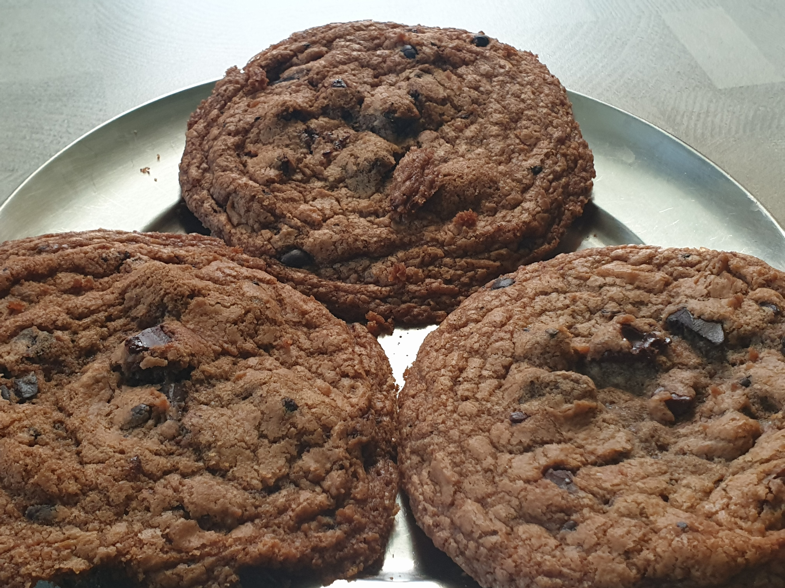
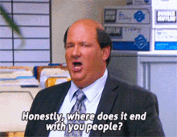

Coronavirus has wrecked havoc on life across the globe resulting in unimaginable number of deaths that are still rising at a worrisome rate. It has aggravated the fault lines in the society with the underprivileged being most severly impacted . In india, in addition to the loss of life and medical complications, covid19 has also resulted in a large-scale migrant crisis - as workplaces shut down, displaced migrant labourers faced loss of income, food shortages, uncertainity about housing and more broadly, their survival. The news has been terrifying and I just hope that people can stay safe and make it out alive.

I am very fortunate and privileged that my life hasn't been overturned by covid19 - I am still working, I have all the neccessities I might need and I am home with my family who are all safe (and I hope it stays that way). So what I am about to say feels very inconsiderate/mean to say, and I know this comes from a position of extreme privilege, but there was been some positive takeaways from the lockdown for me. It has given me an opportunity to review and reset.

> I don't know how I feel about what I have written below. Though this is an attempt to document, it feels inconsiderate to talk about my less-significant (in the broader scheme of things) plus/minuses when so many people are facing devastating hardships and losses. If you accidentally landed here, may I suggest redirecting your attention to learn more about the struggles/injustices happening around you. This post is just a public note to self for accountability. Your time can be better invested somewhere else.

### The Good:
- I am finally reading (books) again.   
- This is the maximum time I have spent with my family in a really long time. Occasional Carrom games are back. 
- Mumma ke haath ka khana!
- I have been spending time getting some financial education from dad.
- I have more time to educate myself about social structures and issues - WIP. Educating myself about the covid19 responses and the migrant crisis, learning about race issues with the #BlackLivesMatter movement, climate issues, etc. 
- Ironically, this might also be the most socially active I have been, maybe since college(?).

### The Bad:
- I haven't run in 3.5 months now (lockdown). 
- Mental peace has been a wreak - Coronavirus, Border enchroachment by China, Migrant crisis, Delhi Riots, Climate Change Red Flags, institutional crackdown on dissenters/protestors... the list doesn't end.

Random Side Note:
- Twitter might be the greatest social network imo. If you can curate a good TL, the sheer amount and diversity of information accessible is mind-blowing. There's also a LOT of trash - which is why curating becomes essential. Also, don't bother with the comments. 

 

# Review: June 2020
### Health
1. **Exercise**:  I don't have have equipment at home except for a pair of 2kg dumbells. So, I do the 'No Equipment' workouts in NTC. I got in 14 workouts - totaling 304 minutes. This is way less than the 31 workouts [496 minutes] I had done in May. This is bad and I'll do better next month. ❌

2. **Walking**:  *\[\begin Backstory\]* The goal for this year was to run 1000 kms following Gyani's challenge. I was already lagging behind after February, when coronavirus (lockdown) happened; and basically my last run was on 20 March 2020. *\[\fin Backstory\]*  
   I still can't go out of the house, so I just walk inside. My monthly average was 4696 steps, of which 3559 were at a healthy pace \[I'll abbreviate this as 4696/3559 going forward\]. This is a good improvement from 3238/1998 in May. ✔️

3. **Weight**:  My weight had increased to ~72.5 kg by the third week of May. Me and my parents had sat down and approximated our calorie intake and expenditure. The plan of action was to exercise, walk more, try Intermittent Fasting (IF), and reduce our intake. I reduced my portion size slightly and now I usually don't have dinner (I'll have it once/twice a week). This ties in nicely to do like a 15/9 IF - I have my breakfast (Chocos+Milk) around 11AM and my last meal (usually a big bowl of fruits) at around 8PM. These are small changes but so far it has been working great. I am now at 70.1 kg (after 6 weeks). ✔️  

   My dad made similar changes and he has lost 8 kgs! 🤯
  

### Learning
4. **Reading**: The good news is that I have started reading books again. The bad news is I don't have any metrics to measure this. I have been following Naval's advice of non-linear and parallel reading, so that makes tracking progress tad difficult.  
For now, I'll just mention the books I think I made (relatively) significant progress on:
   - *Freakonomics - by Stephen Dubner and Steven Levitt* [fin]
   - *Why I'm No Longer Talking To White People About Race - by Reni Eddo-Lodge* 
   - *Autobiography of Malcolm X - by Alex Haley and Malcolm X*
  
   I am happy with this progress, so I'm going to mark this as a win. ✔️

5. **Movies**: The goal is to watch one film each weekend and write about it. I watched 4 films this month, so 4/5.
   - *Nasir (2020) -  directed by Arun Karthick* [it would be an injustice to rate this film]
   - *Gulabo Sitabo (2020) - directed by Shoojit Sircar* ⭐️⭐️
   - *Masaan (2015) - directed by Neeraj Ghaywan* ⭐️⭐️⭐️⭐️🌗
     - rewatched it to listen to [@cuttoscene](https://anchor.fm/cuttoscene)'s podcast but I am yet to listen to the [episode]((https://anchor.fm/cuttoscene/episodes/Episode-2--Masaan-ef9itc)). 
   - *Yeh Jaawani Hai Deewani (2013) - directed by Ayan Mukherjee* ⭐️⭐️⭐️

    I usually write some thoughts about the films I watch on Letterboxd. You can read about them [here](https://letterboxd.com/wanderwonder/). This month I missed one weekend, rewatched an easy film (YJHD) and the only serious review/thoughts I penned was for Nasir; so I'm going to take a loss here. ❌

> 🌗 represents Half ⭐️  

> [Letterboxd](www.letteroxd.com) is a great way to log your films, get recommendations, curate watch lists, write your reviews - its like [GoodReads](https://www.goodreads.com/) but for films.

### Misc
- I made my second batch of chocolate chip cookies and they turned out much better than the first batch. Still some way to go.

   

# Plan: July 2020

### Health
1. **Exercise**: The goal is to exercise 6 days a week (1 rest day), minimum 10 minutes everyday. Additionally, since my average workout duration is around 15 mins, I hope to aggregate atleast 450 minutes. Tracking this with NTC.

2. **Walking**: My June average was 4696/3559 steps. I want to improve this to */6000 steps. Tracking this with Samsung Health.

3. **Weight**: I am at 70.1 kg at the end of June. Extending the trend, maybe I can drop another 2 kgs this month. This is a derived goal rather than an active goal. The underlying principle remains to take moderate scalable actions that don't severly impact health/functioning. Continuing with Exercise + Walking + 15/9 IF to see this through. 

   

### Learning
4. **Reading**: I want to read for atleast 30 mins each day. I need to correlate time with progress/#pages to track this properly. I'll  hopefully come up with a metric this month. I also need to figure out a way to better organize what I am consuming. I don't know how to do that yet, will brainstorm some ideas.

5. **RL**: I am thinking about starting some programming course on RL. I also have to finish David Silver's lectures. I expect to make some progress on this front. Also, need to define metrics to measure progress. 

### Art
6. **Movies**: Watch one film each weekend and write about it.

7. **Photo Documentation**: At the beginning of 2020, I had thought I'd document my life by clicking a photo each day. I did it.. for 5 days before social situations derailed my plans. I will try that again.

### Meta
- *#TODO* add Letterboxd and Goodreads links to the footer.  
- Maybe add a section on interesting things I read/watched, recommendations?

---
  
Gyani also defines rewards and punishments to reinforce goals. That might be a good idea. I'll maybe try it from next month (August).

In case someone still read this, hope you stay safe! 

fin.