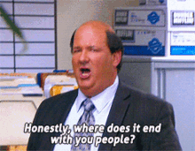

# Month-in-Review: July 2020
### Health
1. **Exercise**: The goal was to exercise for 450 minutes, 6 days a week. I exercised on 25 days, totaling 493 minutes. Its -1 day as per plan but I got the minutes. As a reward, we bought a pair of 5kg dumbells. ✔️

2. **Walking**: I wanted to walk 6000 healthy steps (read */6000) daily. My July average is 7633/5921 steps. I was on-track till 30 July but I got so busy with work on 31st that I forgot to walk. ahhh :rage2: ! ❌

3. **Weight**: The derived goal was to be at 68 kgs. I am at 68.1kg. Since this is a derived goal and there's intra-day variance, let's mark this ✔️

### Learning
4. **Reading**: I thought of 2 metrics to measure reading:  
   1. Time-spent reading.
   2. Number(#) of pages read.  

    I feel the ideal metric would be some weighted combination of the two because just (2) doesn't account for thinking about what you read, and just (1) might overvalue thinking/overthinking. Moreover, presently, I usually read while walking so (1) might be unfairly boosted due to context-switching while multiprocessing. But I don't think that realisitically has a significantly impact (yet. If I increase my reading speed then suboptimalities may become more profound, but that's a concern for a later day). Plus walking is more conducive to thinking. So, I think I will go with (1) for now and start tracking (2) in parallel.

    Here are the books I made progress on:
    - *Autobiography of Malcolm X - by Alex Haley and Malcolm X*
    - *Atomic Habits - by James Clear*
    - *Outliers - by Malcolm Gladwell* [fin]
    - *Raising Your Child's Financial I.Q. - by Robert Kiyosaki* [fin]
    - *Who Moved My Cheese - by Dr. Spencer Johnson* [fin]

    I think I would have read somewhere between 30 to 45 mins on average, each day. I am happy with that. ✔️

5. **RL**: Complete and utter disaster. I completed one week of coursework to realise that the assignments aren't available while auditing. Didn't do much else outside of work. ❌

### Art
6. **Movies**: I only watched 2 films this month. ❌
   - *Baazi (1951) - directed by Guru Dutt* ⭐️⭐️⭐️
   - *Pyaasa (1957) - directed by Guru Dutt* ⭐️⭐️⭐️⭐️  

    I document the films I watch [here](https://letterboxd.com/wanderwonder/).

7. **Photo Documentation**: I started clicking a picture each day since 3 July and haven't missed a single day so far. Yay! ✔️

  <blockquote class="twitter-tweet">
#185: I recently started doing sudokus again. Couldn&#39;t finish the 5⭐ ones. Finally made a breakthrough today. Small wins. :)  Long absence. I blame 2020. <a href="https://t.co/th8VqMY0Ud">pic.twitter.com/th8VqMY0Ud</a>
&mdash; Aayushmaan Jain (@aayushmaan_jain) <a href="https://twitter.com/aayushmaan_jain/status/1279044303986151424?ref_src=twsrc%5Etfw">July 3, 2020</a></blockquote> 

## Misc
- Delhi skies have been so pretty lately, without the air pollution.

  <blockquote class="twitter-tweet">
#210: still seems unreal. <a href="https://t.co/wUSL1WVkkl">pic.twitter.com/wUSL1WVkkl</a>
&mdash; Aayushmaan Jain (@aayushmaan_jain) <a href="https://twitter.com/aayushmaan_jain/status/1288161052903923712?ref_src=twsrc%5Etfw">July 28, 2020</a></blockquote> 

- Got started with Django and request concurrency for a side-project idea. Need to make further progress on this.

## Reflections
- In Atomic Habits, James Clear stresses on the importance of habits and how systems are more important than goals. Coincidentally this monthly logging focuses on creating recurring processes instead of focusing on end goals. For instance, I want to read everyday and not just finish XYZ book. I think it's nice that this is rooted in those principles and shout-out to [Gyani](gyani.net) for unknowningly or knowingly inspiring that. 

- If I analyze the goals where I met the target: 
  - I exercise soon after waking up. 
  - I walk either after lunch, or before sleeping.
  - I read mostly while I walk.
  - I upload a picture usually after wrapping up work.   

  Upon reading Atomic Habits, I realised this is what James Clear meant when he explains Implementation Intention (*I will [BEHAVIOR] at [TIME] in [PLACE]*) and Habit Stacking. And it seems to work well. So now, I need to similarly annotate the other targets. 

- I just realised that might be some confusion for the reader since I am mentioning here how  processes and more important than goals but then I set goals for next month, etc. There's a difference. The goals being talked about in Atomic Habits are end-result goals - such as running a marathon or finishing a book; whereas the monthly targets that I am setting can be thought of as benchmarks. It is desired behaviour aggregated over a month to set a reference point to measure progress. Does that make sense? 

# Plan: August 2020

### Health
1. **Exercise**: Let's up the target to 20 minutes of exercise (on average) and I am allowed 1 rest day per week. So, I should have somewhere around 20*30 = 600 minutes at the month's end. Tracking this with NTC.

2. **Walking**: Let's do */7000 steps (7000 healthy steps) this month. Tracking this with Samsung Health.

3. **Weight**: I am at 68.1 kgs. Continuing with the 2kg drop per month trend, let's see if we can get to the desired goal of 66 kgs. Continuing with Exercise + Walking + 15/9 IF to see this through. 

   

### Learning
4. **Reading**: I want to read for atleast 40 mins each day. I am not finely tracking this yet.

5. **Projects**: Build a MVP for the Django project idea.

### Art
6. **Movies**: Watch one film each weekend and write about it.

7. **Photo Documentation**: Continue clicking a picture each day.

# Recommendations
- \[Twitter Thread\] *Ankur Warikoo's thread on time management*

<blockquote class="twitter-tweet">
A thread on managing time...
&mdash; Ankur Warikoo (@warikoo) <a href="https://twitter.com/warikoo/status/1281498178135756801?ref_src=twsrc%5Etfw">July 10, 2020</a></blockquote> 

- \[Article\] [*How To Understand Things - by Nabeel Qureshi*](https://nabeelqu.co/understanding)
  - This is a great article on meta-learning and it coincidentally ends with one of my favorite quotes by a photographer. 

> "If your pictures aren't good enough, you're not close enough." - Robert Capa

- \[Video\] [*Indian History AMA with Ramchandra Guha ft Kumar Varun, Biswa, Neville Shah, Sorabh Pant*](https://www.youtube.com/watch?v=M6ljz-b0s8M)
  - Lite but interesting watch as they talk about post-independence history, cricket and what ifs.
  - Growing appreciation for Kumar Varun.