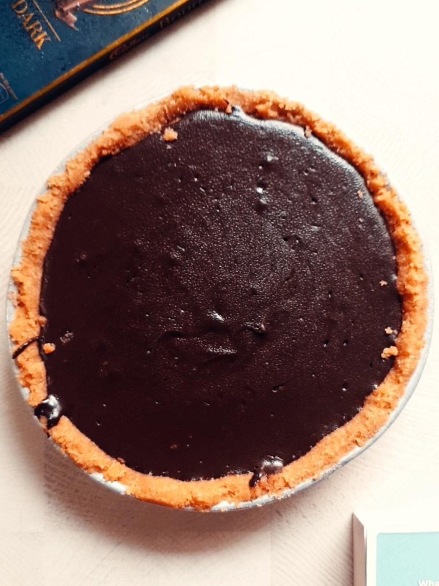

# Month-in-Review: August 2020
### Health
1. **Exercise**: Surpassed the target of 20 mins daily by logging 628 minutes over 26 days.
I did 562 minutes/32 workouts with NTC and 66 minutes/8 workouts following [Lucy Wyndham-Read's Workout "to loose belly fat"](https://youtu.be/yL_dE81O_mw). This video has 77 million views and that got me curious. However, I didn't take measurements so I don't know how well it worked. I'll measure it now and continue it for another week and report my findings. ✔️ 

2. **Walking**: Walked 8370/7250 steps. ✔️

3. **Weight**: I am at 66.3 kgs. As I am nearing my arbitrary goal of 66 kgs, I realise that I still need to burn a lot more fat and build muscles so the body fat % is healthy. Could this be a trackable metric? ✔️

### Learning
4. **Reading**: Here are book's I made progress on:
   - *Autobiography of Malcolm X - by Alex Haley and Malcolm X* [fin]
   - *Atomic Habits - by James Clear* [fin]
   - *How to Win Friends and Influence People - by Dale Carnegie* [fin]
   - *The 4-Hour Workweek - by Tim Ferris*

   I have started actively logging on [Goodreads](www.goodreads.com/user/show/36625337) now. ✔️

5. **Projects**: I had to build a MVP for the Django project idea. Made no progress. ❌

### Art
6.  **Movies**: Again, I watched only 2 films this month. ❌
    - *American Psycho (2000) - directed by Mary Harron*
    - *Project Power (2020) - directed by Henry Joost, Ariel Schulman* ⭐️⭐️
    
    I document the films I watch [here](https://letterboxd.com/wanderwonder/).

7.  **Photo Documentation**: Missed a couple of days, but this is going fine. ✔️

<blockquote class="twitter-tweet" data-conversation="none">
#239: fairy god-figures. 🤭 <a href="https://t.co/qA9zDsJ6QT">pic.twitter.com/qA9zDsJ6QT</a>
&mdash; Aayushmaan Jain (@aayushmaan_jain) <a href="https://twitter.com/aayushmaan_jain/status/1298655943593308162?ref_src=twsrc%5Etfw">August 26, 2020</a></blockquote> 

## Misc
- I made a chocolate tart. 

   

- When you retire old phones/laptops, remove the password barricade so that you can still access them when you forget the password. #LessonsLearntTheHardWay

# Plan: September 2020

### Health
1. **Exercise**: 25 mins of daily exercise. Tracking this with NTC.

2. **Walking**: */8000 steps this month. Tracking this with Samsung Health.

3. **Weight**: I don't have a new weight target but I still need to burn fat and grow muscles/strength. Not sure how to measure this.

### Learning
4. **Reading**: Read daily.

5. **Touch Typing**: My current typing speed is approx 50 wpm. I'll practise 20 mins daily and see where I get.

### Art
6. **Movies**: Watch one film each weekend and write about it.

7. **Photo Documentation**: Continue clicking a picture each day.

# Interesting Things I Read/Saw
- \[Article\] [*Alcohol As A Social Technology To Check The Trustworthiness Of Others*](https://hndex.org/7798063)
- \[Article\] [*The Truth Is Paywalled But The Lies Are Free*](https://www.currentaffairs.org/2020/08/the-truth-is-paywalled-but-the-lies-are-free/)
- \[Article\] [*It's Time To Change The Way The Media Reports On Protests. Here Are Some Ideas.*](https://www.niemanlab.org/2020/06/its-time-to-change-the-way-the-media-reports-on-protests-here-are-some-ideas/)
- \[Article\] [*The Age Of Mass Surveillance Will Not Last Forever*](https://www.wired.com/story/the-age-of-mass-surveillance-will-not-last-forever/)